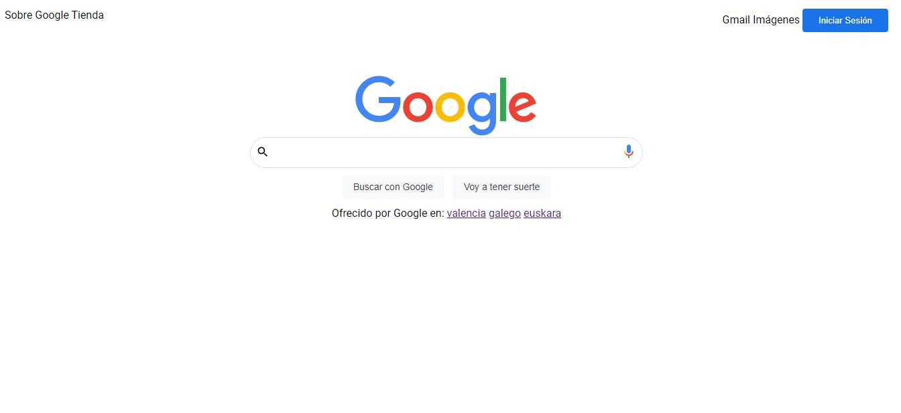

# Copia de Google
Este proyecto se trata de una copia de google realizada en el bootcamp de thebridge.

## Tecnologias
* HTML
* CSS

### Instalacion y despliegue
Para hacer funcionar este proyecto primero necesitas clonarte el repositorio desde el siguiente enlace:

```
enlace al repo
```
Luego de clonarte el repositorio, debes abrir la carpeta en visual studio code y darle a go live.

#### Previews 



---
## Autor

Este proyecto fue desarrollado por : [Ivan Puebla](http://github.com/ivanpuebla10)


